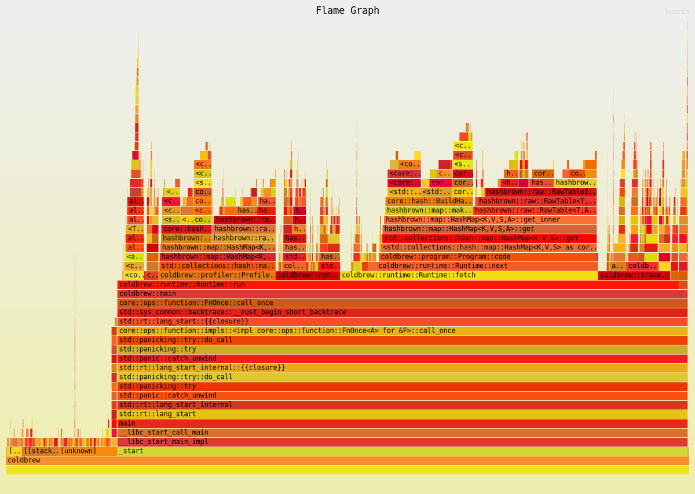
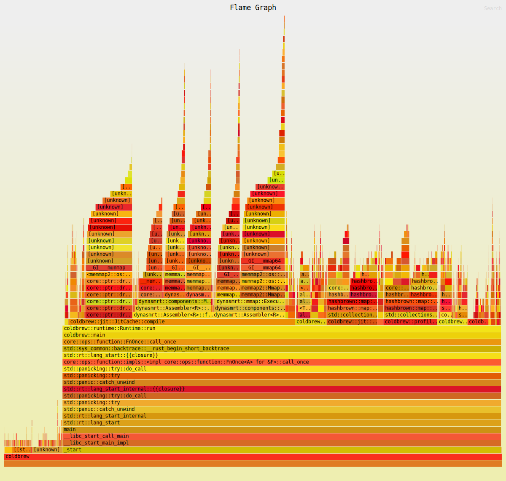

# coldbrew

`coldbrew` is a (WIP) tracing JIT compiler for the Java Virtual Machine, with
support for primitive numeric types (`int`, `long`, `float`, `double`) and
serves as a demo project for how JIT compilers work in genenral.

`coldbrew` is inspired primarly by TigerShrimp[^1] and some ideas from Higgs[^2]
the TigerShrimp C++ implementation[^3] is very readable and was of huge help
to debug some issues along the line.
Other implementations I've found useful is LuaJIT 2.0 and Mike Pall's email
about the LuaJIT internals which you can in the mailing list[^4].

While I tried to remain as close as the TigerShrimp implementation as possible,
there are some changes in the overall structure since we are using Rust.

I was planning to start with ARM64[^5] then do x86 but I changed machines and
basically refactored the code to start with x86 support.

I was originally planning to use the C++ implementation as a baseline to test
against but I didn't have much success building it.

## How it works

`coldbrew` bundles a traditional bytecode interpreter with a runtime for the JVM
as per the Java SE7 specification described in the link below[^6], during the
execution the bytecode is profiled and execution traces are recorded.

The trace contains all the information needed to compile the bytecode to native
such as the entry, exit codes and the bytecode of the core loop. Once a trace
is ready we pipeline it to the JIT cache for compilation and cachine, when we
reach that code path again, execution leaves the VM and executes the compiled
native trace before returning control to the VM.

### Trace recording and execution

To identify hotpaths we use heuristics that target *loop headers* which we can
identify when we encounter a *backwards branch* instruction. Once such branch
is identified we record the *program counter* where we branch as the start of
the loop.

But it's not sufficient to track *backwards branches* we need to calculate
their execution frequency to identify if they are *hot*, the invocation frequency
threshold (currently set to 2) triggewrs the start of recording.

An example of a trace would be a sequence of bytecode like this :

```asm

iload_1
sipush 1000
if_icmpge B
iinc 2, 1
iinc 1, 1
goto A

```

But the above trace contains two exits, the first to label `B` and the second
to label `A` so the tracelets would be essentially what is in between.

```asm

iload_1
sipush 1000

```

```asm

iinc 2, 1
iinc 1, 1

```

We could take this one step further and do something similar to speculative
execution, where at the `B` branch `if_icmpge B` we record a hint to whether
the branch should be taken or not. If the branch is not taken we can *stitch*
both tracelets and use the hint as a guard instruction. This is implemented
in `flip_branch` where we flip the branch instruction during recording and
use it as an implicit guard during the runtime. If a guard instruction fails
at runtime then control is transfered back to the virtual machine interpreter
and resumes execution. This is where the need for *side exits* comes up because
when transfer control back to the VM any state mutations to local variables
need to be written back to the VM current frame.

So the above trace ends up as such :

```asm

1: iload_1
2: sipush 1000
3: if_icmpge .exit
4: iinc 1,1
5: iinc 0,1
6: goto 3
.exit :
    trap

```

Where `trap` is a pseudo instructions that signals the JIT to transfer control
back to the virtual machine. We also do a label swap where use relative in-trace
offsets, this is essentialy since when we compile `goto` at line 6 we need to
jump to a label that exists within the trace. One way to solve this is to create
a local map of `{pc, label}` where we compile `goto 3` as `jmp .label_3` where
`.label_3` would be created during the initial recording. Other way to solve this
is to generate the code in reverse which allows you to encounter the target branch
in this case `goto 3` before the actual target which eliminates the need for the stub
technique we mentionned which requires keeping track of all inner branches.

Recording bytecode aborts whenever we encounter a non recoverable state this
involves native method invocations, exceptions and recursive functions.

When it comes to executing the trace we assemble the native trace using `dynasm`
and record it as a pointer to a function with the following signature.

```rust

fn execute(*mut i32, *mut u8) -> i32

```

The first argument is a pointer to the local variables which we cast to `i32`
this is done mainly because we used `enum Value` to represent dynamic values
and we don't control the memory layout of the enums (plus it's simpler).

The second argument is a pointer to the existing traces and this is used to
to keep executing if the exit program counter is another trace that we have
already prepared.

Once execution is complete we overwrite the current VM frame local variables
array with the ones we passed to `execute` which you will notice is set as
*mutable*. This is how we "save" mutated local state when exiting the JIT.

## Going Further

It is possible to take this approach even further by incorporating analysis
within the trace recording phase. Essentially once you've recorded a trace
you could transform it to SSA form and run any kind of analysis or optimization
such as Dead-Code Elimination, Common Subexpression Elimination, Constant folding
and Inlining and much more.

## Performance Analysis

The following flamegraph shows the initial implementation performance on the
integration test suite.



This was recorded without debug prints and show that we spend a lot of time in
`fetch` this was due to using a `HashMap` for recording code sections in the JVM
class file.

The first thing that came to mind was to switch to using a `Vec` this improved
perf quite a bit and we went from spending 37% of the time in `fetch` to about
4%. Now the biggest bottleneck was the `JitCache::compile` function (but since
we try and compile everything) this was quite expected. Once we change how often
we compile we can build and stitch larger traces.



## Acknowledgments

I would like to thank the authors of the TigerShrimp work and for providing
their implementation. The thesis is an exellent introduction to Tracing JITs
and is a must read to anyone who wishes to understand the overall architecture
and details of tracing JIT interpreters.


[^1]: [TigerShrimp: An Understandable Tracing JIT
Compiler](https://odr.chalmers.se/server/api/core/bitstreams/87898837-623a-46f0-bcdc-06d2bf10805d/content)

[^2]: [Higgs: A New Tracing JIT for
JavaScript](https://pointersgonewild.com/2012/12/08/higgs-my-new-tracing-jit-for-javascript/)

[^3]: [Github/TigerShrimp](https://github.com/TigerShrimp/TracingJITCompiler)

[^4]: [Archive: On LuaJIT 2.0](https://gist.github.com/jmpnz/fb8a1f2c9c0e70b4d2b0cc6cb5ddec25)

[^5]: [It's called arm64](https://lore.kernel.org/lkml/CA+55aFxL6uEre-c=JrhPfts=7BGmhb2Js1c2ZGkTH8F=+rEWDg@mail.gmail.com/)

[^6]: [Java SE7 Spec](https://docs.oracle.com/javase/specs/jvms/se7/html/)

[^7]: [HotpathVM: An Effective JIT Compiler for Resource-constrained Devices](https://www.usenix.org/legacy/events/vee06/full_papers/p144-gal.pdf)

